# Games

초등학교 6학년 때 프로그래밍이라는 것을 처음 알게 해준 `GameMaker` 라는 툴로 중학교 3학년 때 까지 총 3년간 만들어온 게임들을 모아놓은 공간입니다.
    

# 🍄 메이플 돈벌기 (2011-05-15)

> 빨간포션을 100원에 사면 일정 시간마다 10원을 만들어 냅니다.
>
> 이와 같이 특정 돈을 만들어 내어 지갑에 돈이 차곡차곡 쌓이는 재미를 느낄 수 있는 게임입니다.

### Release

- `2.0` [다운로드](https://github.com/geoje/Games/raw/master/Release/%EB%A9%94%EC%9D%B4%ED%94%8C%EB%8F%88%EB%B2%8C%EA%B8%B02.exe)
- `8.2` [다운로드](https://github.com/geoje/Games/raw/master/Release/%EB%A9%94%EC%9D%B4%ED%94%8C%EB%8F%88%EB%B2%8C%EA%B8%B08.2.exe)

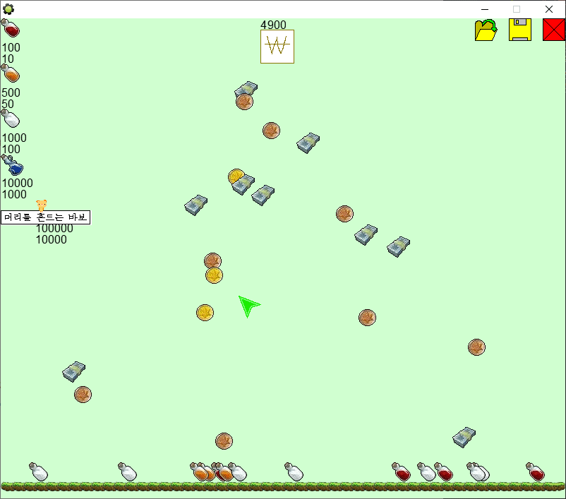
    

# 🔵 Fly Blue Ball (2011-06-11)

> 관성이 없는 공튀기기 입니다.
>
> 중력과 충돌을 통한 상호작용을 처음 사용한 게임입니다.

### Release

- `0.2` [다운로드](https://github.com/geoje/Games/raw/master/Release/FlyBlueBall0.2.exe)

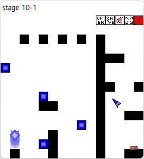
    

# 🏰 YGH타워디펜스 (2011-09-25)

> 전형적인 타워디펜스이며 가진 돈으로 타워를 설치해서 지나가는 몬스터를 잡는 게임입니다.
>
> 스타크래프트 라는 게임에서 업그레이드와 벌쳐의 지뢰에 영감을 받아 해당 요소도 추가하였습니다.

### Release

- `0.4` [다운로드](https://github.com/geoje/Games/raw/master/Release/YGH%ED%83%80%EC%9B%8C%EB%94%94%ED%8E%9C%EC%8A%A40.4.exe)

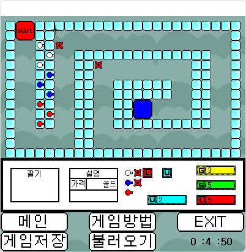
    

# 🧭 YGH미로찾기 (2011-10-04)

> 한정된 시야 속에서 캐릭터가 '마나'를 사용해서 '대쉬'를 사용해서 벽을 넘어 미로를 탈출하는 게임입니다.

### Release

- `latest` [다운로드](https://github.com/geoje/Games/raw/master/Release/YGH%EB%AF%B8%EB%A1%9C%EC%B0%BE%EA%B8%B0.exe)

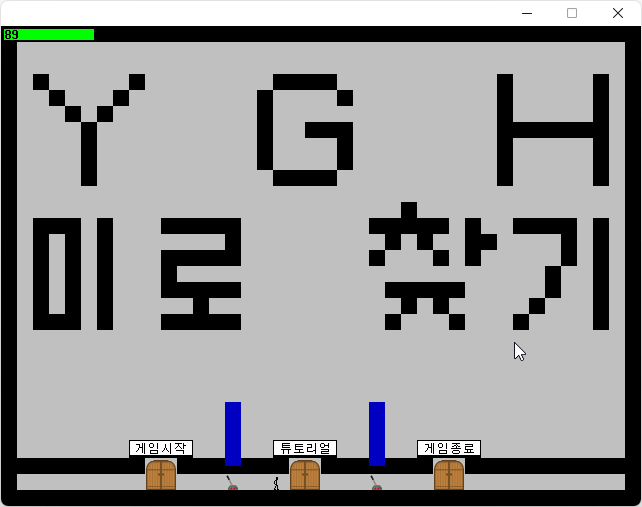
    

# 🗺️ CrazyMaze (2011-11-26)

> 똑같이 생긴 벽들 속에서 숨겨진 미로를 탈출하는 게임입니다.

### Release

- `latest` [다운로드](https://github.com/geoje/Games/raw/master/Release/CrazyMaze.exe)

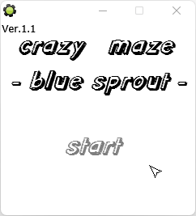
    

# 🧟‍♂️ YGH좀비킬러 (2011-11-26)

> 횡스크롤 환경으로 좀비들을 죽여 다음 단계로 가는 게임입니다.
> 튜토리얼 정도만 플레이 가능합니다.

### Release

- `latest` [다운로드](https://github.com/geoje/Games/raw/master/Release/YGH%EC%A2%80%EB%B9%84%ED%82%AC%EB%9F%AC.exe)

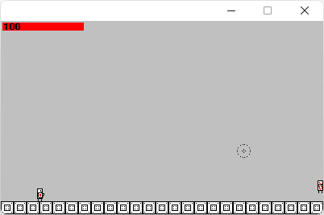
    

# ⚔️ 새싹RPG (2011-11-26)

> RPG 게임을 만들어 보려다가 인디게임 수준을 넘어선 많은 양에 포기한 작품입니다.
>
> 튜토리얼 정도만 플레이 가능합니다.

### Release

- `latest` [다운로드](https://github.com/geoje/Games/raw/master/Release/%EC%83%88%EC%8B%B9RPG.exe)

    

# 🧍‍♂️ AndEverythingStartedToFall (2012-01-13)

> And Everything Started To Fall 를 카피코딩하여 제작한 게임입니다.

### Release

- `latest` [다운로드](https://github.com/geoje/Games/raw/master/Release/AndEverythingStartedToFall.exe)

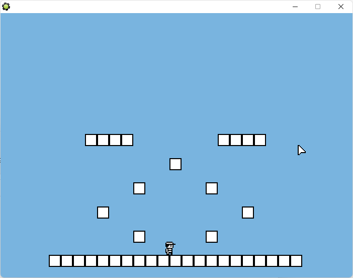
    

# 🟥 세상에서 가장 어려운 게임 (2012-01-13)

> The World Hardest Game 를 카피코딩하여 제작한 게임입니다.

### Release

- `latest` [다운로드](https://github.com/geoje/Games/raw/master/Release/HardestGame.exe)

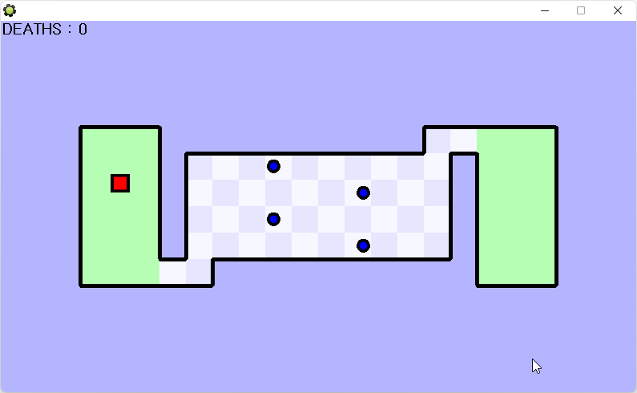
    

# ⚫ YGH Ball (2012-02-22)

> 게임메이커의 노하우를 모두 녹여 만든 공튀기기 게임 입니다.
>
> 중력과 공의 관성 위험한 장애물과 움직이는 발판 그리고 스위치 등등 많은 요소들이 어우러져있어 고도의 집중과 컨트롤로 깰 수 있는 게임입니다.
>
> F2: 게임 도중 메인메뉴로 이동

### Release

- `1.2` [다운로드](https://github.com/geoje/Games/raw/master/Release/YGHBall1.2.exe)
- `1.4` [다운로드](https://github.com/geoje/Games/raw/master/Release/YGHBall1.4.exe)

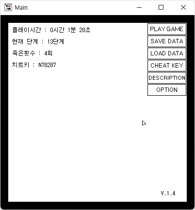
    

# ⬜ Oneline Platform (2012-03-16)

> 소켓 통신을 활용하여 처음으로 만든 온라인 게임입니다.
>
> 업적을 달성하여 칭호를 획득할 수 있고 다같이 미로찾기를 할 수도 있습니다.

### Release

- `latest` [다운로드](https://github.com/geoje/Games/raw/master/Release/OnlinePlatform.exe)

    

# ⚫ Oneline YGHBall (2012)

> YGH Ball 게임을 온라인으로 즐길 수 있습니다.
>
> 맵 종류는 기존 게임과 다르게 새로운 맵들로 구성되어 있고 OnlinePlatform을 기반으로 제작하였으며 파일 공유 기능까지 추가하였습니다.

### 조작법

- `R` 처음 위치로 돌아가기
- `I` 인벤토리창 열기
- `S` 정보창 열기
- `P` 설정창 열기
- `Alt + F4` 메세지창 없이 게임종료
- `Ctrl + C` 글 입력한것을 모두 복사
- `Ctrl + V` 글 복사한것을 붙여 넣기

### Release

- `latest` [다운로드](https://github.com/geoje/Games/raw/master/Release/OnlineYghBall.exe)

    

# ⬛ Polygon Platform (2012-09-01)

> 그동안 쌓아온 플랫폼 게임의 기술을 녹여 `GameMaker Studio` 라는 툴로 안드로이드 앱 제작을 하였습니다.

### Release

- `demo(Window)` [다운로드](https://github.com/geoje/Games/raw/master/Release/PolygonPlatformDemo.zip)
- `demo(Android)` [다운로드](https://github.com/geoje/Games/raw/master/Release/PolygonPlatformDemo.apk)

    

# 🔌 Redstone Simulator (2013-04-02)

> 마인크래프트 라는 게임에서 레드스톤을 평면으로 다룰 수 있는 프로그램입니다.
>
> 이 게임을 통해 디지털논리를 일찍 접할 수 있게 되었고 재밌게 사용했었습니다.

### 조작법

- `Mouse Left Click` 블럭제거
- `Mouse Right Click` 블럭설치

- `Wheel` 설치할 블럭 각도조절
- `Ctrl + Wheel` 설치할 아이템 변경
- `Alt + Drag` 뷰이동
- `Alt + Wheel` 줌 인/아웃

### Release

- `latest` [다운로드](https://github.com/geoje/Games/raw/master/Release/RedstoneSimulatorDemo.exe)

### 아래 사진에 사용된 회로

- 무선 레드스톤 (연결방법: 둘중 하나를 오른쪽클릭후 목적지에서 땜)
- XOR
- AND
- NOT
- FlipFlop

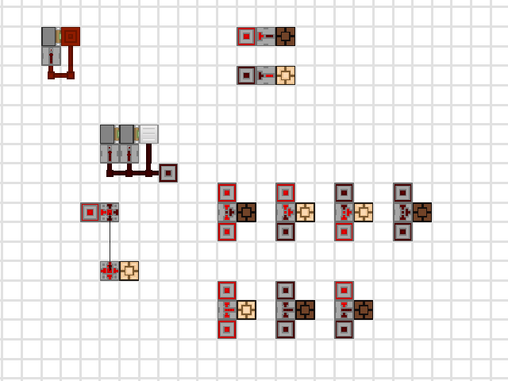
    

# ⚫ YGH Ball 2 (2013-02-13)

> 제 `GameMaker` 인생 마지막 작품인 종합 게임 입니다.
>
> 맵 에디터까지 있어서 직접 맵을 만들고 사람들과 공유하여 플레이할 수 있습니다.

### Release

- `2.1.1` [다운로드](https://github.com/geoje/Games/raw/master/Release/YGHBall2.zip)

### Single Play

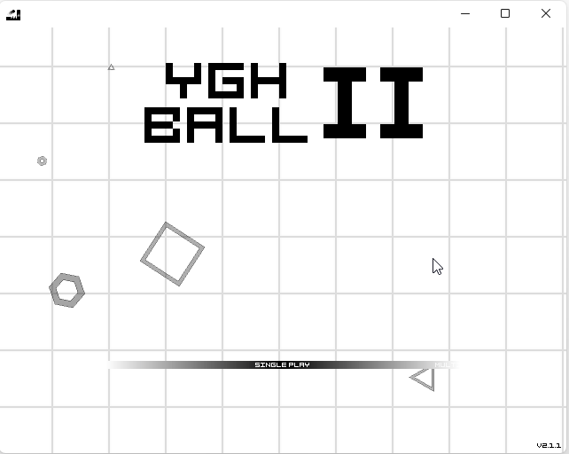
  

### Multi Play

  

### Mini Game - Shooting

  

### Map Editor

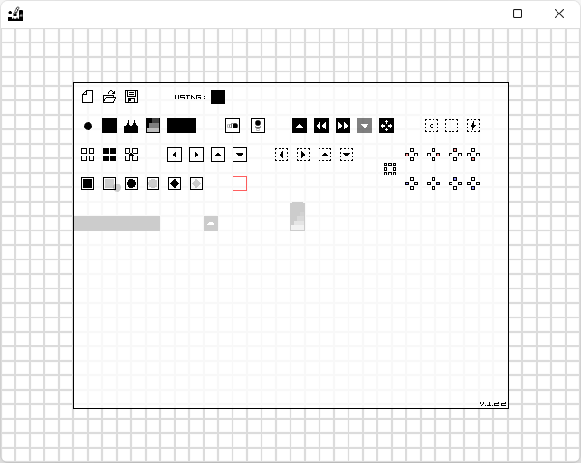
    
